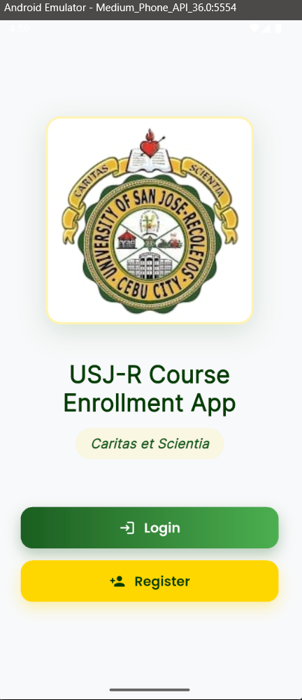
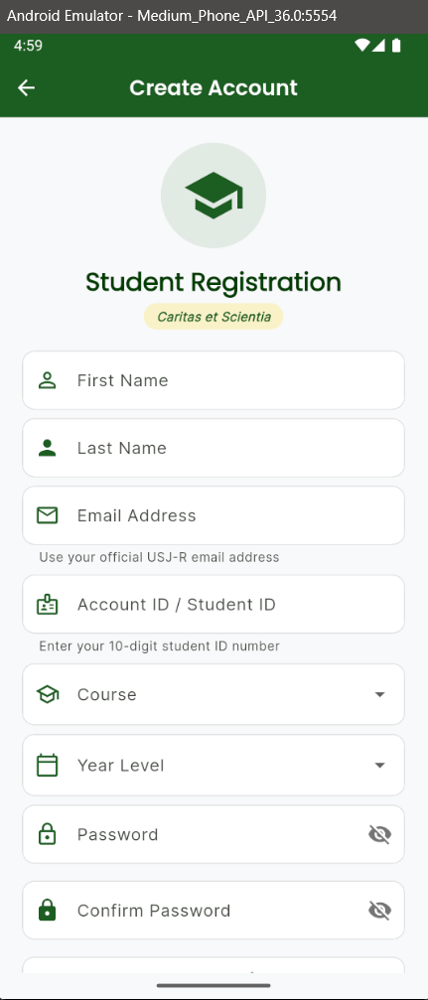
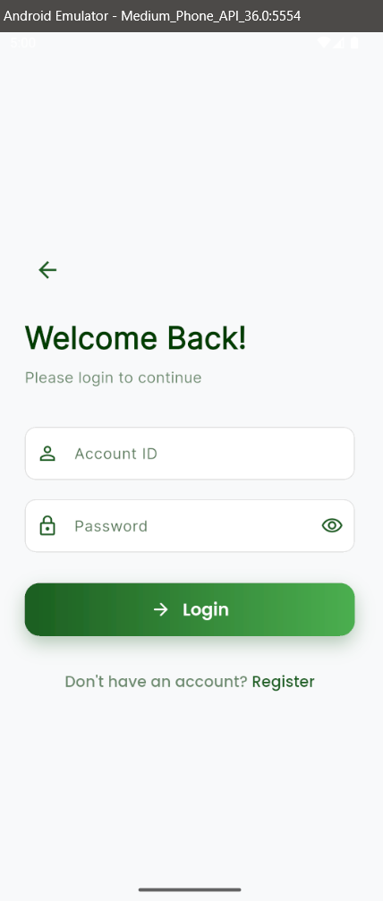
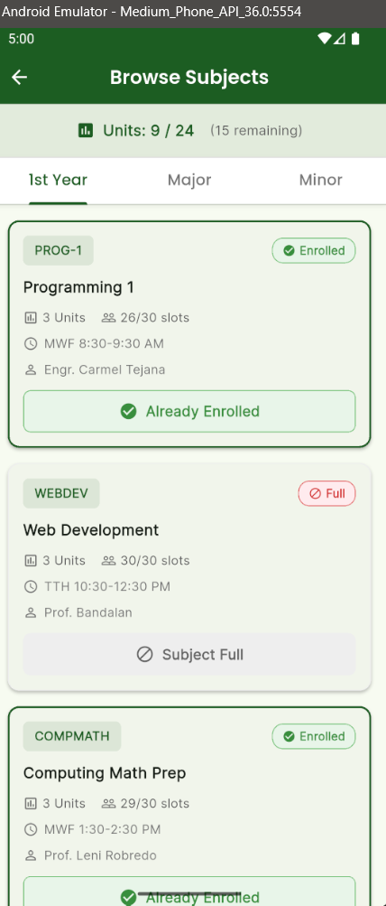
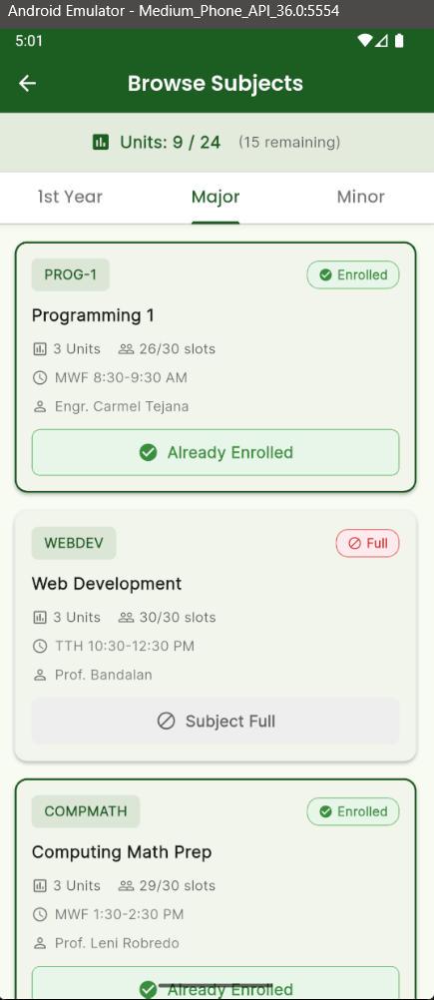
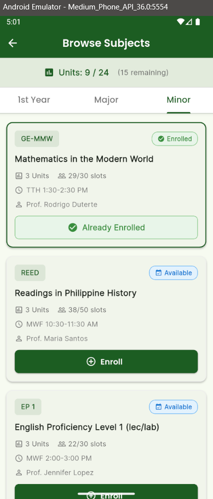
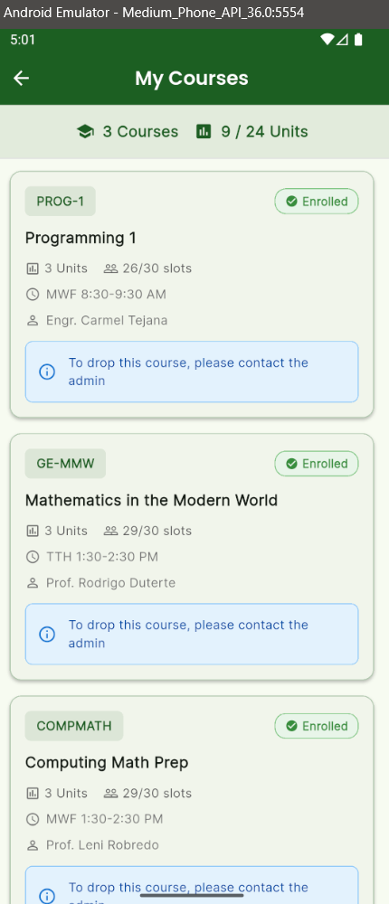
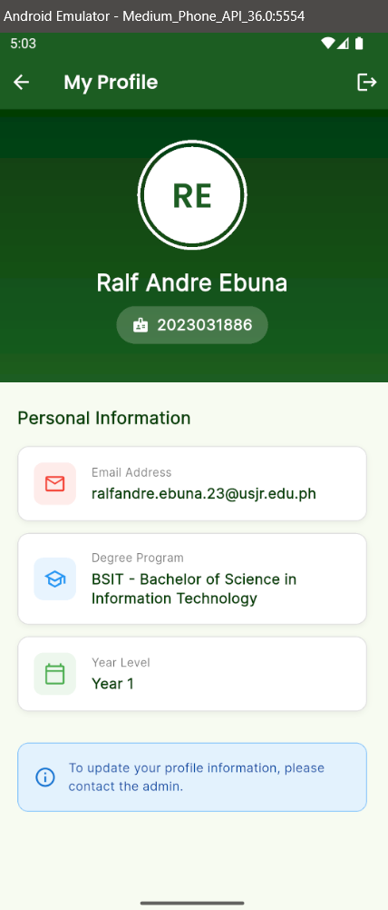

# USJ-R Course Enrollment App

A Flutter-based course enrollment system for the University of San Jose-Recoletos (USJ-R).

## 🎓 About

This application allows USJ-R students to:
- Browse available subjects by category (1st Year, Major, Minor)
- Enroll in subjects with unit limit validation (max 24 units)
- View enrolled subjects and manage enrollments
- Track enrollment status and unit counts

## 🎨 Design

**Official USJ-R Brand Colors:**
- Primary: Deep Green (#1B5E20)
- Accent: Gold (#FFD700)
- Motto: *Caritas et Scientia*

## 🚀 Getting Started

### Prerequisites
- Flutter SDK (latest stable version)
- Dart SDK
- Android Studio / VS Code
- Android SDK for mobile development
- Chrome/Edge for web development

### Installation

1. **Clone the repository**
   ```bash
   git clone https://github.com/yourusername/flutter-course-enrollment-app.git
   cd flutter-course-enrollment-app/my_course_app
   ```

2. **Install dependencies**
   ```bash
   flutter pub get
   ```

3. **Generate provider files**
   ```bash
   dart run build_runner build --delete-conflicting-outputs
   ```

4. **Run the app**
   ```bash
   # For web
   flutter run -d edge
   
   # For Android
   flutter run -d <device_id>
   ```

## 📱 Features

### Authentication
- Student registration with USJ-R email validation
- Secure login with hashed passwords
- Account ID validation (10-digit student ID)

### Enrollment Management
- Browse subjects by category
- Real-time unit tracking (0/24 units)
- Enrollment confirmation dialogs
- Subject capacity checking
- Drop subject requests (pending admin approval)

### UI/UX
- Responsive design for mobile and web
- Material Design 3
- Google Fonts (Poppins & Inter)
- Loading states and error handling
- Success/error notifications

## 🎬 Demo & Presentation

📺 **[Complete Demo Script](DEMO_SCRIPT.md)** - Detailed walkthrough script covering:
- App feature demonstration (6-7 minutes)
- Technical deep dive on data synchronization (3-4 minutes)
- Code examples showing Riverpod state management
- Data flow from Registration → Login → Profile
- Enrollment synchronization across screens

Perfect for presentations, code reviews, and technical demonstrations!

---

## 📸 Application Screenshots

### 1. Welcome Screen


The landing page featuring:
- USJ-R official logo and branding
- App title: "USJ-R Course Enrollment App"
- University motto: *Caritas et Scientia*
- **Login** button (Deep Green #1B5E20)
- **Register** button (Gold #FFD700)

### 2. Student Registration


Comprehensive registration form with:
- **Personal Information**: First Name, Last Name
- **Email Address**: USJ-R email validation (@usjr.edu.ph)
- **Account ID**: 10-digit student ID validation
- **Course Dropdown**: BSIT, BSCS, BSIS, ACT programs
- **Year Level Dropdown**: Year 1-4 selection
- **Password Fields**: With strength indicator and visibility toggle
- **Terms of Service**: Checkbox acceptance required

### 3. Login Screen


Clean login interface with:
- "Welcome Back!" greeting
- Account ID input field
- Password field with visibility toggle
- Login button
- "Don't have an account? Register" link

### 4. Course Enrollment Dashboard


Main dashboard displaying:
- **Enrollment Status Card** (Orange gradient)
  - Active status badge
  - Courses enrolled count (3 Courses)
  - Unit tracking (9/24 units)
  - Remaining units indicator (15 units remaining)
- **Academic Information Section**
  - View Grades option
  - Enrollment Schedule access
- **Navigation Buttons**
  - My Courses (view enrolled subjects)
  - Browse Courses (explore available subjects)
- Login success notification

### 5. Browse Subjects - 1st Year Tab


Subject browsing with category tabs:
- **Tabs**: 1st Year, Major, Minor
- **Subject Cards** showing:
  - Course code and enrollment status badge
  - Subject title
  - Units, slots available, schedule, instructor
  - Enrollment status (Already Enrolled / Subject Full)

**Example Subjects:**
- PROG-1: Programming 1 (Enrolled)
- WEBDEV: Web Development (Full)
- COMPMATH: Computing Math Prep (Enrolled)

### 6. Browse Subjects - Major Tab


Major subjects display with same card layout showing course availability and enrollment status.

### 7. Browse Subjects - Minor Tab


Minor subjects including:
- **GE-MMW**: Mathematics in the Modern World (Enrolled)
- **REED**: Readings in Philippine History (Available - Enroll button)
- **EP 1**: English Proficiency Level 1 (Available - Enroll button)

Each card shows:
- 3 Units
- Available slots (e.g., 38/50, 22/30)
- Schedule (MWF, TTH)
- Instructor name
- Enroll button for available subjects

### 8. My Courses


Enrolled subjects overview:
- Header: "3 Courses" and "9/24 Units"
- List of enrolled subjects with full details
- Blue info box: "To drop this course, please contact the admin"
- Shows all enrolled subjects with their:
  - Course code and status
  - Units and slots
  - Schedule and instructor

**Enrolled Courses:**
1. PROG-1: Programming 1
2. GE-MMW: Mathematics in the Modern World
3. COMPMATH: Computing Math Prep

### 9. User Profile


Student profile information:
- **Profile Header** (Deep Green background)
  - User initials avatar (RE)
  - Full name: Ralf Andre Ebuna
  - Student ID: 2023031886
- **Personal Information Section**
  - Email: ralfandre.ebuna.23@usjr.edu.ph
  - Degree Program: BSIT - Bachelor of Science in Information Technology
  - Year Level: Year 1
- Blue info box: "To update your profile information, please contact the admin"

---

### UI Design Highlights
- **Color Scheme**: USJ-R official colors (Deep Green #1B5E20 and Gold #FFD700)
- **Typography**: Clean, modern fonts with proper hierarchy
- **Status Indicators**: Color-coded badges (Green for enrolled, Red for full, Blue for available)
- **Responsive Cards**: Rounded corners, proper spacing, and shadows
- **Consistent Icons**: Material Design icons throughout
- **User Feedback**: Success notifications, info boxes, and clear status messages

## 🔒 Security Features

### Authentication & Data Protection
- **Password Hashing**: All passwords are hashed using **bcrypt** algorithm before storage
- **Email Validation**: Strict validation for USJ-R institutional emails (@usjr.edu.ph)
- **Student ID Validation**: 10-digit format enforcement with regex validation
- **Local Storage**: Secure data persistence using SharedPreferences
- **No Plain Text Passwords**: Passwords are never stored in plain text
- **Session Management**: Secure user session handling with Riverpod state management
- **Bcrypt Security**: Industry-standard password hashing with salt rounds for enhanced security

### Input Validation
- **Form Validation**: Comprehensive validation for all user inputs
- **Password Strength Indicator**: Real-time password strength feedback
- **Password Requirements**:
  - Minimum 8 characters
  - At least one uppercase letter
  - At least one lowercase letter
  - At least one number
  - At least one special character
- **Email Format Validation**: Regex-based email format checking
- **Account ID Sanitization**: Removes spaces and dashes, ensures numeric input

### Data Integrity
- **Duplicate Prevention**: Checks for existing Account IDs during registration
- **Unit Limit Enforcement**: Maximum 24 units per enrollment period
- **Slot Capacity Checking**: Prevents enrollment in full subjects
- **Enrollment Validation**: Prevents duplicate course enrollments

## 🏗️ Architecture & Design Principles

### SOLID Principles Implementation

#### 1. **Single Responsibility Principle (SRP)**
Each class has one clear responsibility:
- **`UserStorageService`**: Handles user data persistence only
- **`EnrollmentStorageService`**: Manages enrollment data only
- **`SubjectStorageService`**: Handles subject data only
- **`Authenticator`**: Responsible for password hashing only
- **Providers**: Each provider manages a specific state domain

#### 2. **Open/Closed Principle (OCP)**
- **Extensible Models**: `Subject`, `Enrollment`, and `EnrolledSubject` models can be extended without modification
- **Provider Architecture**: New providers can be added without modifying existing ones
- **Service Layer**: Storage services can be extended with new methods without breaking existing functionality

#### 3. **Liskov Substitution Principle (LSP)**
- **Widget Composition**: All custom widgets extend Flutter's base widgets properly
- **State Management**: Providers follow Riverpod's contract and can be substituted
- **Model Inheritance**: Models maintain consistent behavior across the application

#### 4. **Interface Segregation Principle (ISP)**
- **Focused Services**: Each service exposes only the methods needed by its clients
- **Minimal Provider Interfaces**: Providers expose only necessary state and actions
- **Separation of Concerns**: Authentication, storage, and UI logic are separated

#### 5. **Dependency Inversion Principle (DIP)**
- **Provider Pattern**: High-level UI depends on abstract providers, not concrete implementations
- **Service Abstraction**: Screens depend on service interfaces, not direct storage implementations
- **Loose Coupling**: Components communicate through well-defined interfaces

### State Management
- **Riverpod** for state management
- Function-based providers for actions
- Auto-generated providers with `riverpod_annotation`
- Immutable state management patterns

### Data Storage
- **SharedPreferences** for local data persistence
- JSON serialization for complex objects
- Asynchronous data operations
- Error handling and data validation

### Project Structure
```
lib/
├── core/
│   └── constants/
│       ├── app_colors.dart
│       ├── app_strings.dart
│       └── app_constants.dart
├── domain/
│   └── models/
│       ├── subject.dart
│       ├── enrollment.dart
│       └── enrolled_subject.dart
├── presentation/
│   ├── screens/
│   │   ├── login_screen.dart
│   │   ├── register_screen.dart
│   │   ├── enrollment_home_screen.dart
│   │   ├── subject_list_screen.dart
│   │   └── my_subjects_screen.dart
│   └── widgets/
│       ├── subject_card.dart
│       ├── custom_app_bar.dart
│       └── enrollment_confirmation_dialog.dart
├── providers/
│   ├── enrollment_provider.dart
│   ├── subject_provider.dart
│   └── auth_provider.dart
└── services/
    ├── enrollment_storage_service.dart
    ├── subject_storage_service.dart
    └── user_storage_service.dart
```

## 🐛 Known Issues & Fixes

### Critical Bug Fix (Nov 19, 2025)
**Issue:** Provider disposal error during enrollment
**Solution:** Changed from class-based to function-based providers

📖 **See [BUGFIX_DOCUMENTATION.md](my_course_app/BUGFIX_DOCUMENTATION.md) for detailed information**


### After Modifying Providers
Always regenerate the `.g.dart` files:
```bash
dart run build_runner build --delete-conflicting-outputs
```

### Hot Reload vs Hot Restart
- **Hot Reload (r):** UI changes only
- **Hot Restart (R):** Logic changes, provider updates
- **Full Rebuild:** After major changes or errors

### Testing
```bash
# Run tests
flutter test

# Run with coverage
flutter test --coverage
```

## 📦 Dependencies

### Core
- `flutter_riverpod: ^2.6.1` - State management
- `riverpod_annotation: ^2.6.1` - Provider code generation
- `shared_preferences: ^2.3.3` - Local storage

### UI
- `google_fonts: ^6.2.1` - Typography
- `crypto: ^3.0.6` - Password hashing

### Development
- `build_runner: ^2.4.14` - Code generation
- `riverpod_generator: ^2.6.3` - Provider generation

## 🎯 Roadmap

- [ ] Admin panel for enrollment approval
- [ ] Email notifications
- [ ] Schedule conflict detection
- [ ] Grade viewing
- [ ] Payment integration
- [ ] Mobile app optimization


## 📄 License

This project is developed for educational purposes for the University of San Jose-Recoletos.

## 🆘 Support

For issues or questions:
1. Check [BUGFIX_DOCUMENTATION.md](my_course_app/BUGFIX_DOCUMENTATION.md)
2. Review error messages carefully
3. Ensure all dependencies are installed
4. Verify `.g.dart` files are generated
